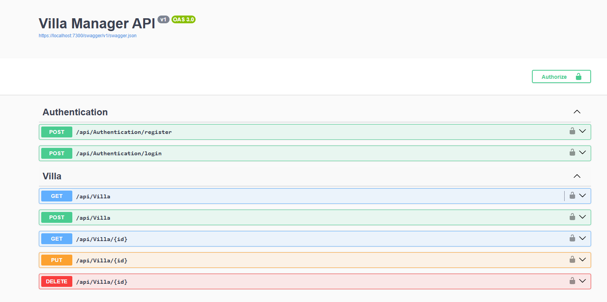

# 🏡 Villa Manager

A full-stack web application built with **ASP.NET Core 6**, **Entity Framework Core**, and **Blazor Server** to help manage villas for real estate purposes. It allows authenticated users to create, edit, search, and manage villas, upload files, preview images and PDFs, and view villa locations using Google Maps.

---

## 🚀 Features

- ✅ User authentication & role-based access
- 🏘️ Villa management (CRUD)
- 📂 Upload multiple files (images, PDFs, Word, Excel, ZIP)
- 🔍 Search & filter villas by name, date, and size
- 🌍 Google Maps integration for villa locations
- 🖼️ File previews (images and PDFs)
- 💾 SQL Server for structured data storage
- 📦 Modular clean architecture (API, Domain, Data, Services, UI)

---

## 🗂️ Project Structure
VillaManager.sln
├── VillaManager.API # ASP.NET Core Web API
├── VillaManager.Data # EF Core DbContext, Repositories
├── VillaManager.Domain # DTOs, Enums, Entity models
├── VillaManager.Services # Business logic layer
├── VillaManager.Blazor # Blazor Server UI (Frontend)

